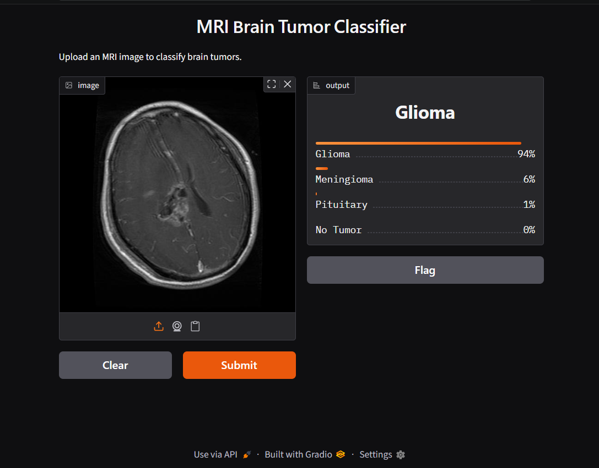
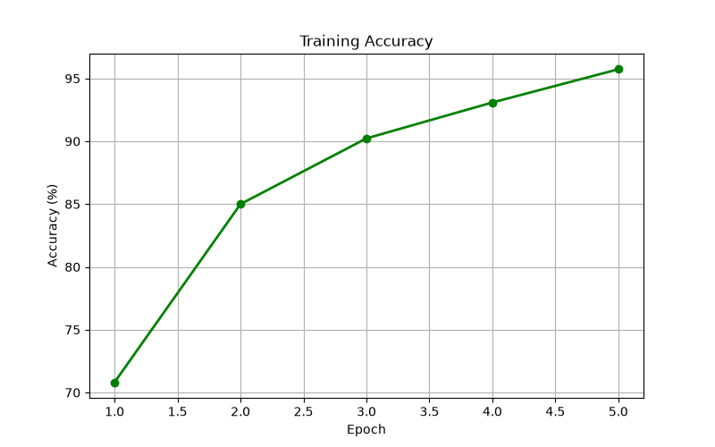
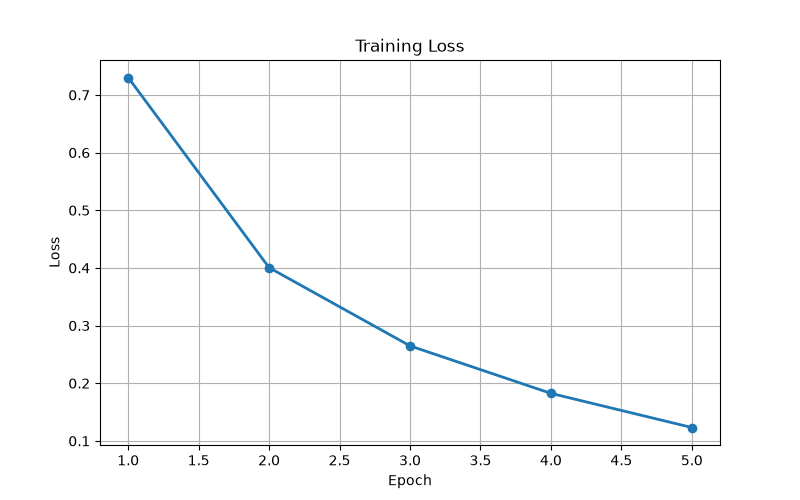
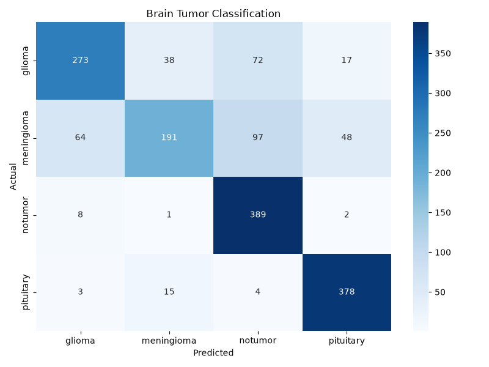

# 🧠 MRI Brain Tumor Classifier

A deep learning project that classifies brain MRI scans into four categories using a Convolutional Neural Network (CNN) built with PyTorch.

This project was built as a foundation for a larger research-oriented system. The current version focuses on brain tumor classification, while future updates will improve the model with better architectures, explainability techniques, and early-stage risk assessment.

## Preview

### Web Interface



---

### Training Accuracy



---

### Training Loss



---

### Confusion Matrix



---

## Features

- CNN built from scratch using PyTorch
- Brain MRI classification into four classes:
  - Glioma
  - Meningioma
  - Pituitary
  - No Tumor
- GPU acceleration with CUDA support
- Training and evaluation pipeline
- Automatic model saving
- Training loss and accuracy graphs
- Confusion matrix generation
- Single-image prediction
- Gradio web interface for easy testing

---

## Project Structure

```
MRI-Brain-Scanner/
│
├── dataset/
│
├── models/
│   ├── cnn.py
│   └── __init__.py
│
├── outputs/
│   ├── models/
│   ├── graphs/
│   ├── confusion_matrix/
│   ├── predictions/
│   └── logs/
│
├── app.py
├── config.py
├── train.py
├── evaluate.py
├── predict.py
├── requirements.txt
└── README.md
```

---

## Dataset

This project uses a publicly available Brain MRI dataset containing four classes:

- Glioma
- Meningioma
- Pituitary
- No Tumor

Training Images: **5600**

Testing Images: **1600**

---

## Model

Current Architecture:

- 3 Convolution Layers
- ReLU Activation
- Max Pooling
- Dropout
- Fully Connected Classifier

Current Version: **Custom CNN**

---

## Results

Current baseline model performs well on most classes while still showing room for improvement, particularly on meningioma classification.

---

## Running the Project

### Train the model

```bash
python train.py
```

### Evaluate the model

```bash
python evaluate.py
```

### Predict a single MRI image

```bash
python predict.py
```

### Launch the web application

```bash
python app.py
```

---

## Technologies Used

- Python
- PyTorch
- TorchVision
- CUDA
- Matplotlib
- Seaborn
- Scikit-learn
- Gradio

---

## Future Improvements

This repository will continue to evolve over time. Planned updates include:

- Data augmentation
- Better CNN architecture
- Transfer Learning (ResNet / EfficientNet)
- Grad-CAM visualizations
- Early stopping
- Learning rate scheduler
- Hyperparameter tuning
- TensorBoard support
- Explainable AI (XAI)
- Experimental early-stage tumor risk assessment

---

## Disclaimer

This project is intended for educational and research purposes only.

It is **not** a medical diagnostic tool and should not be used for clinical decision-making.

---

## Author

**Raghav Bohora**

Computer Science Engineering Student

Always open to learning, improving models, and building practical AI projects.